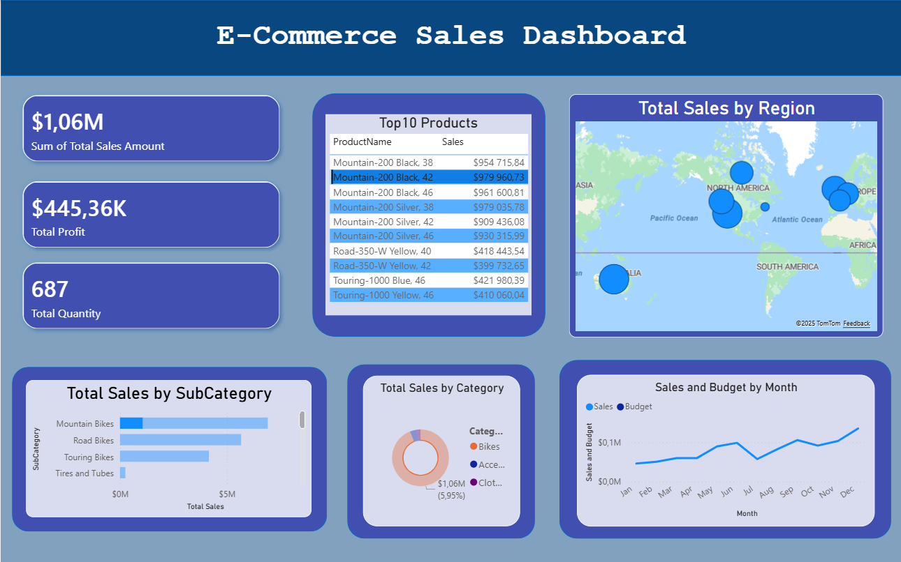

# 📊 E-commerce Sales Dashboard (Power BI)

## 📌 Project Overview
This project is an interactive Power BI dashboard built using e-commerce sales data.
The dashboard helps business stakeholders understand sales performance, trends, and key revenue drivers.

## 🔍 Key Business Questions Answered
- What are the best-selling products?
- When do sales peak during the year?
- Which categories and regions generate the most revenue?

## 📈 Dashboard Features
- KPI cards for Total Sales, Total Profit, and Total Quantity
- Monthly sales trend analysis
- Top 10 best-selling products
- Category and subcategory performance
- Regional sales distribution using a map
- Interactive filters (Year)

## 🛠️ Tools Used
- Power BI Desktop
- Microsoft Excel

## 📷 Dashboard Preview

## 📁 Files in This Repository
- `Ecommerce_Sales_Dashboard.pbix` – Power BI dashboard file
- `dashboard_preview.png` – Dashboard screenshot

## 🚀 Skills Demonstrated
- Data cleaning and transformation
- Time-series analysis
- Business performance analysis
- Data visualization and storytelling
